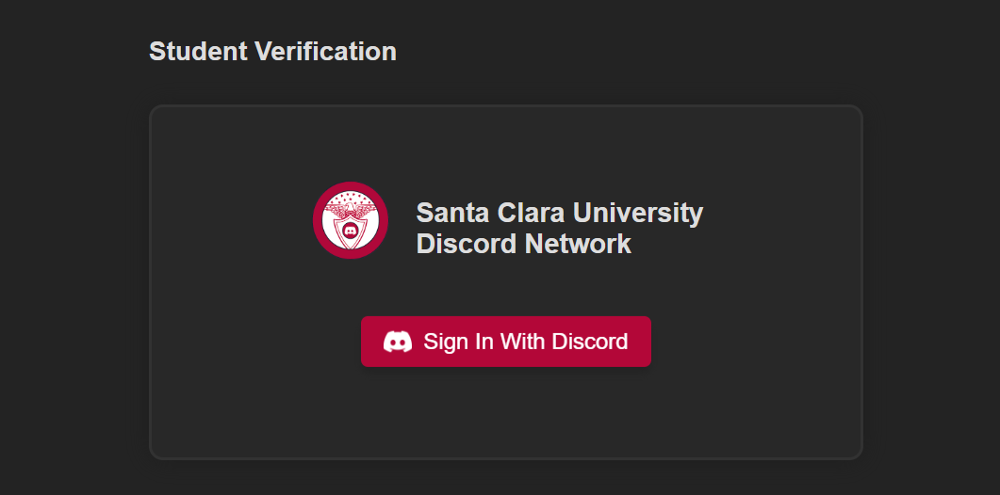

# Discord OAuth2 Verification System
A user-friendly web interface authenticated by Discord's REST API, authenticated with OAuth2, to assign and manage Discord roles on the Santa Clara University Discord Network.

- Utilizes Discord's v6 HTTPS/REST API.
- Back-end REST API written in Typescript, using Deno server and oak.
- Front-end client written in HTML5, CSS, and JavaScript. Uses jQuery, Bootstrap, Popper, and Google Fonts.
- Accompanied with the [Santa Clara University Discord bot](https://github.com/JAVAB3ANS/scu-discord-bot).

## Login Page

## Dashboard Page

## Credits
- Original idea and implementation by [LTSENG01](https://github.com/LTSENG01) who made [Discord-RoleBot](https://github.com/LTSENG01/Discord-RoleBot)

- Fullstack app adapted by [JAVAB3ANS](https://github.com/javab3ans), front-end flourishes by [501A-Designs](https://github.com/501A-Designs), and guidance from [themexpride](https://github.com/themexpride) and [Saamstep](https://github.com/Saamstep)
